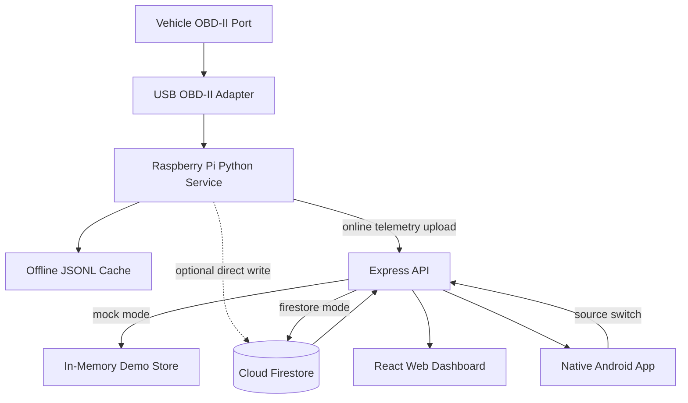
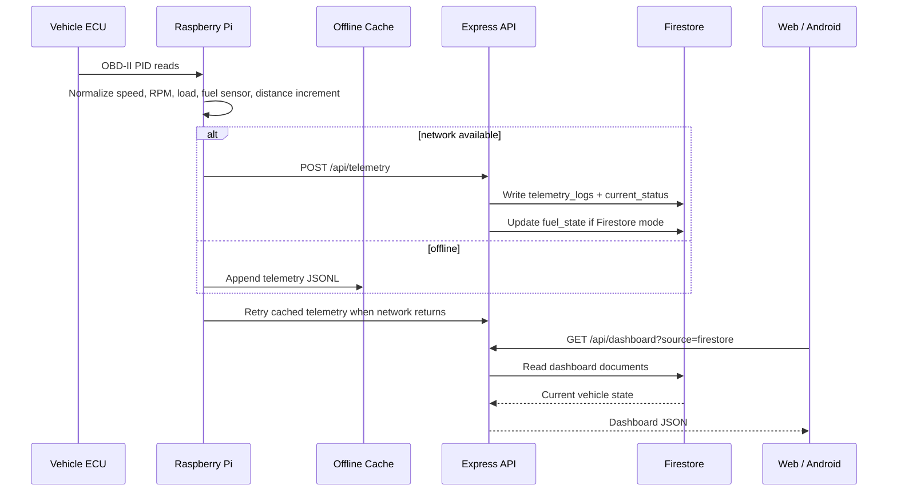
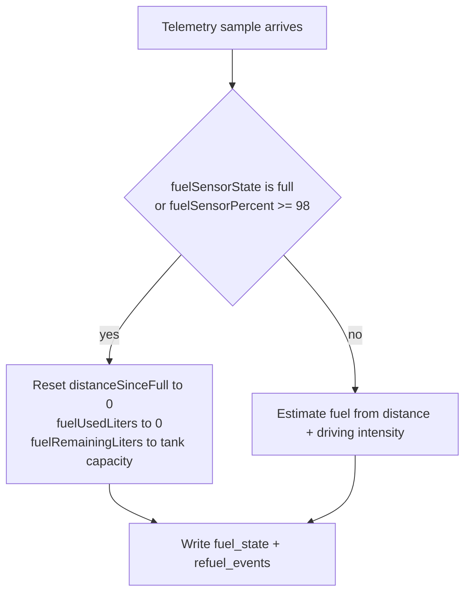

# SmartFuel Data Flow and Firestore Model

This document describes how telemetry moves through SmartFuel when Firestore is enabled, what data each layer owns, and how mock mode can stay available for demos.

## Runtime Modes

```text
Mock Mode
Raspberry Pi mock/provider -> Express API memory store -> Web + Android

Firestore Mode
Raspberry Pi OBD/provider -> Express API or Firestore -> Firestore collections -> Express API -> Web + Android
```

Mock mode stays the default so the project always runs without Firebase keys. Firestore mode is enabled by environment variables and an app setting.

## High-Level Architecture



## Telemetry Write Flow



## Full Tank Reset Logic

The original fuel gauge can still report full, but does not reliably rise after partial refuels. SmartFuel treats a reliable full signal as a reset point.



## Fuel Estimation With Driving Intensity

Base model:

```text
1 liter = 10 km
1 km = 0.1 liters
```

SmartFuel applies a multiplier for aggressive driving:

```text
sampleFuelUsed = distanceIncrementKm * 0.1 * drivingIntensityMultiplier
```

Driving intensity considers:

- high RPM
- high engine load
- low-speed city driving
- idle time

This keeps the model understandable while acknowledging that a short aggressive drive can use more fuel than a calm short drive.

## Firestore Collection Shape

```text
vehicles/{vehicleId}
  name
  make
  model
  year
  status
  tankCapacityLiters
  maxRangeKm
  consumptionLitersPerKm

vehicles/{vehicleId}/runtime/fuel_state
  fuelRemainingLiters
  fuelUsedLiters
  estimatedRangeKm
  fuelPercentage
  lastFullResetAt
  updatedAt

vehicles/{vehicleId}/runtime/current_status
  speedKph
  rpm
  engineState
  drivingIntensity
  engineLoadPercent
  coolantTempC
  batteryVoltage
  estimatedOdometerKm
  tripDistanceKm
  timestamp

vehicles/{vehicleId}/telemetry_logs/{logId}
  recordedAt
  speedKph
  rpm
  distanceIncrementKm
  estimatedOdometerKm
  engineLoadPercent
  coolantTempC
  batteryVoltage
  fuelSensorPercent
  fuelSensorState
  engineState
  obd

vehicles/{vehicleId}/trips/{tripId}
  startedAt
  endedAt
  distanceKm
  drivingSeconds
  idleSeconds
  averageSpeedKph
  maxSpeedKph
  averageRpm
  fuelUsedLiters

vehicles/{vehicleId}/refuel_events/{eventId}
  eventType
  litersAdded
  fuelAfterLiters
  pricePerLiter
  totalCost
  odometerKm
  note
  createdAt

vehicles/{vehicleId}/notifications/{notificationId}
  type
  severity
  title
  body
  isRead
  createdAt
```

An example starter dataset is available in [database/firestore-seed.example.json](../database/firestore-seed.example.json).

## Source Switching

The apps call the backend with a source query:

```text
GET /api/dashboard?source=mock
GET /api/dashboard?source=firestore
```

The Android app has a settings switch. When Firestore mode is enabled, it requests `source=firestore`. If Firestore is not configured, the backend returns a clear configuration error and the app can keep using cached/mock data.

## Required Firebase Environment Variables

```text
FIREBASE_PROJECT_ID=your-project-id
FIREBASE_WEB_API_KEY=your-web-api-key
SMARTFUEL_FIRESTORE_VEHICLE_ID=your-vehicle-id
SMARTFUEL_DATA_SOURCE=mock
```

For production, replace API-key-only access with Firebase Auth or a service-account-backed backend. The current REST adapter is intended to make integration shape-ready without committing secrets.
